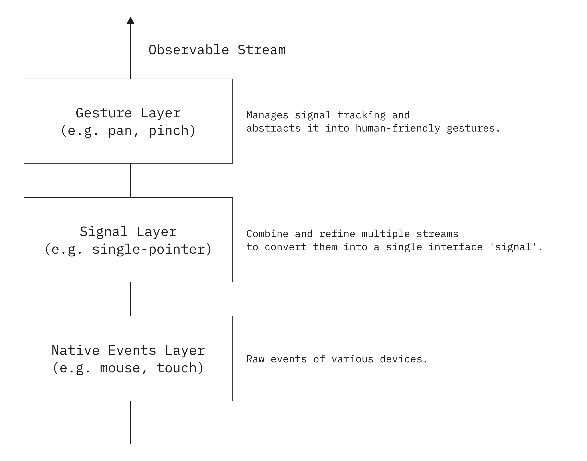

# Cereb

Composable, high-performance gesture recognition for JavaScript runtimes.

```typescript
import { pan } from "@cereb/pan";

pan(element, { threshold: 10 }).subscribe((event) => {
  element.style.transform = `translate(${event.deltaX}px, ${event.deltaY}px)`;
  element.innerText = `velocity: ${event.velocityX}, ${event.velocityY}`;
});
```

Alternatively, it can be extended using pipelines.

```typescript
import { pan } from "@cereb/pan";
import { withVelocity } from "@cereb/pan/extensions";

const gestureStream = pipe(
  pan(element, { threshold: 10 }),
  withVelocity(),
)

gestureStream.subscribe((event) => {
  element.style.transform = `translate(${event.deltaX}px, ${event.deltaY}px)`;
  element.innerText = `velocity: ${event.velocityX}, ${event.velocityY}`; // Type inference automatically
});
```

## Why cereb?

- **Observable-Based** - Compose with `pipe`, `filter`, `merge` and other stream operators
- **Extensible** - Add velocity tracking, axis locking, and custom behaviors via operators
- **Zero GC Jank** - Object pooling keeps animations smooth at 60+ events/sec

## Architecture

<p align="center">
  
</p>

| Layer | Role |
|-------|------|
| **Gesture Layer** | Recognizes gestures (pan, pinch) from signal streams |
| **Signal Layer** | Normalizes inputs into a unified interface |
| **Native Events Layer** | Raw pointer, touch, mouse events |

## Packages

| Package | Description |
|---------|-------------|
| [@cereb/pan](./packages/gesture/pan) | Pan gesture recognition |
| [@cereb/single-pointer](./packages/signal/single-pointer) | Unified pointer/touch/mouse input |
| [@cereb/gesture](./packages/core/gesture) | Gesture event framework |
| [@cereb/signal](./packages/core/signal) | Base signal abstraction |
| [@cereb/stream](./packages/core/stream) | Lightweight reactive streams (zero dependencies) |

## License

MIT
